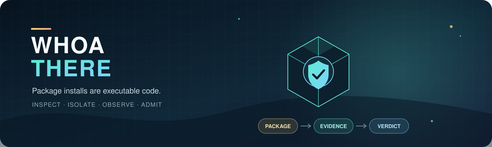
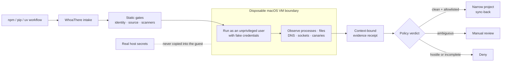
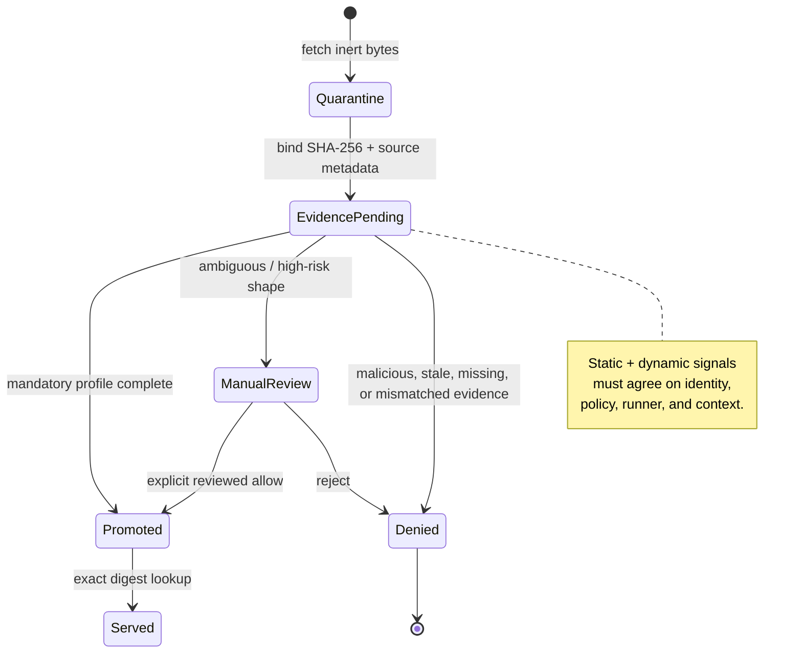
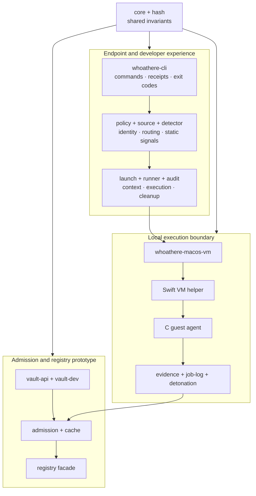

<p align="center">
  
</p>

<p align="center">
  <strong>Run the risky part somewhere your credentials aren't.</strong><br />
  A research-driven package supply-chain security prototype for Python and Node developers.
</p>

<p align="center">
  
  
  
  
  
</p>

<p align="center">
  <a href="#the-idea">The idea</a> ·
  <a href="#how-it-works">How it works</a> ·
  <a href="#what-i-built">What I built</a> ·
  <a href="#research-notes">Research</a> ·
  <a href="#quick-tour">Quick tour</a>
</p>

## The idea

An `npm install`, `pip install`, or `uv sync` is not just a download. It can execute lifecycle
scripts, build backends, native code, startup hooks, and imports with the same credentials and
filesystem access as the developer who invoked it.

I built **WhoaThere** to explore a specific question:

> What would it take to treat dependency installation as untrusted code execution instead of an
> ordinary package download?

WhoaThere combines ecosystem-aware source policy, static scanners, behavioral detonation inside a
separate macOS VM, fake credentials and canaries, evidence-bound decisions, and deny-by-default
copy-back. The current deliverable is a CLI-first Apple Silicon macOS beta; the repository also
contains a deeper prototype of a Vault-backed package admission and registry architecture.

### The security bet

| Package-security problem | WhoaThere's response |
| --- | --- |
| Install code inherits developer and CI secrets | Execute supported workflows in a separate VM populated with fake canaries |
| A scanner can miss novel or environment-gated behavior | Combine static findings with process, filesystem, DNS, socket, and credential-touch telemetry |
| A clean observation can belong to the wrong artifact or run | Bind evidence to digest, package identity, request, policy, runner session, and execution context |
| Copying an entire environment recreates the blast radius | Sync back only narrow, project-local, allowlisted outputs after a clean verdict |
| Security tools become unusable when they hide uncertainty | Return reason-coded JSON receipts and make incomplete evidence a review or deny outcome |

## How it works

The local beta moves package execution across a real trust boundary while keeping the developer's
secrets on the host.



Static checks run first because some package shapes should never reach execution. The VM then
captures behavioral evidence with fake secrets, denies public fallback by default, terminates the
job process group, and returns a receipt. Scanner or AI output may add evidence, but neither is
allowed to authorize copy-back on its own.

### Admission is a state machine, not a score

The broader architecture models package admission as explicit state transitions. A package is not
servable merely because it accumulated a high score; mandatory evidence must be complete and
coherent for the exact artifact and context.



## What I built

This project crosses product research, systems programming, security engineering, test design, and
release operations rather than stopping at a proof-of-concept scanner.

| Area | Selected work |
| --- | --- |
| **macOS isolation** | A Swift `Virtualization.framework` helper, VM lifecycle commands, guest readiness protocol, C guest agent, unprivileged execution, bounded project mirroring, cleanup, and allowlisted sync-back |
| **Behavioral detection** | Canary credentials, process and filesystem telemetry, DNS/socket observation, CI-delayed activation checks, install/build/import probes, and sanitized evidence receipts |
| **Package intelligence** | npm and PyPI identity discovery, dependency-confusion rules, direct/VCS/editable source handling, lifecycle and PEP 517 detection, binary/native risk classes, version age, and last-known-good memory |
| **Evidence integrity** | SHA-256 artifact binding, canonical cache identities, freshness and execution-context checks, challenge/response provider proofs, single-use replay protection, and fail-closed result validation |
| **Vault prototype** | Quarantine-to-promotion admission, npm/PyPI registry facades, immutable content-addressed cache, tenant-aware records, local HTTP simulation, audit-safe admin contracts, and an AWS deployment skeleton |
| **Adversarial validation** | A real-world attack harness covering canary exfiltration, DNS TXT stagers, fetched shell execution, reverse-shell capability, poisoned upgrades, native payloads, and tampered or missing telemetry |
| **Release engineering** | Signed and notarized Apple Silicon archives, checksum verification, fresh-user installation, runtime qualification, scanner bootstrapping, and local beta pressure suites |

The implementation is organized as a **19-crate Rust workspace** with more than **50,000 lines of
Rust** and **500 in-tree tests**, plus the Swift VM helper, C guest agent, shell/Python validation
harnesses, infrastructure, and research documentation.

### Code architecture



## Research notes

WhoaThere started with threat modeling and interface contracts before implementation. The research
trail is kept in the repository so design claims are reviewable and limitations stay visible.

| Question | Research artifact | Key conclusion |
| --- | --- | --- |
| What are we protecting, and from whom? | [Product scope](docs/outputs/GOAL-01/product-scope.md) and [threat model](docs/outputs/GOAL-01/threat-model.md) | Install/build/import risk, dependency confusion, maintainer takeover, exfiltration, and insecure outage fallback need distinct controls |
| Where must the trust boundaries sit? | [System context](docs/outputs/GOAL-02/system-context.md) and [detonation runtime ADR](docs/outputs/GOAL-06/ADR-009-detonation-runtime.md) | On macOS, telemetry is a backstop; the VM is the primary execution boundary |
| What evidence is safe and sufficient to retain? | [Evidence model](docs/outputs/GOAL-06/evidence-model.md) and [admission pipeline](docs/outputs/GOAL-06/admission-pipeline.md) | Record redacted behavior and identity bindings, not secrets, source dumps, or network payloads |
| How might malicious packages evade a naive sandbox? | [Detonation matrix](docs/outputs/GOAL-06/detonation-matrix.md) and [malicious fixture plan](docs/outputs/GOAL-01/malicious-fixtures.md) | Vary platform, CI state, timing, package type, network path, and activation phase |
| How do we avoid overclaiming readiness? | [Quality hardening summary](docs/outputs/GOAL-10/three-pass-summary.md) and [current-state report](docs/product-build-run/whoathere-current-state-report.html) | Separate implemented, validated, beta, simulated, and future-production capabilities |

Several design principles emerged from that work:

1. **Scanners can veto; they cannot authorize.** Absence of a finding is not evidence of safety.
2. **Identity precedes behavior.** Evidence is useful only when bound to the artifact, source,
   request, policy, runner, and environment that produced it.
3. **Uncertainty is a result.** Missing telemetry and unsupported package shapes fail closed instead
   of being converted into optimistic scores.
4. **The output boundary matters as much as the execution boundary.** A safe VM run can still become
   unsafe if arbitrary guest files are copied back.
5. **Operational behavior is part of security.** Outages, stale proofs, replay, cleanup failure,
   release signing, and audit redaction are modeled explicitly.

## Quick tour

The non-VM portions build anywhere Rust does. Dynamic detonation and sync-back require Apple Silicon
macOS, Xcode tooling, and a provisioned WhoaThere VM.

```sh
git clone https://github.com/joncooper/whoathere.git
cd whoathere

# Explore the CLI and its fail-closed red-team assertions.
cargo run --manifest-path whoathere/Cargo.toml -p whoathere-cli -- --help
cargo run --manifest-path whoathere/Cargo.toml -p whoathere-cli -- vm red-team-gate

# Inspect a deliberately malicious npm fixture without executing it.
cargo run --manifest-path whoathere/Cargo.toml -p whoathere-cli -- \
  scan manifest npm-package-json whoathere/tests/fixtures/npm/postinstall-exfil/package.json

# Run the workspace test suite.
cargo test --manifest-path whoathere/Cargo.toml
```

For the complete local beta workflow—VM initialization, scanner setup, package-risk assessment,
detonation, receipts, and sync policy—see the
[macOS local beta CLI guide](docs/product-build-run/macos-local-beta-cli-guide.md).

<details>
<summary><strong>Example: assess an untrusted repository</strong></summary>

```sh
export WHOATHERE_STATE="$HOME/.whoathere/macos-vm-validation"

whoathere scanners run \
  --workspace /absolute/path/to/project \
  --ecosystem auto \
  --state-dir "$WHOATHERE_STATE" \
  --execute --json > scanner-receipt.json

whoathere intake assess \
  --workspace /absolute/path/to/project \
  --ecosystem auto \
  --state-dir "$WHOATHERE_STATE" \
  --scanner-receipt scanner-receipt.json \
  --execute --json \
  npm -- install
```

`intake assess` combines package-risk analysis with VM detonation and keeps sync-back disabled. A
preview without `--execute` intentionally returns manual review because no dynamic evidence exists.

</details>

## Repository map

| Path | Purpose |
| --- | --- |
| [`whoathere/crates`](whoathere/crates) | Rust crates for policy, detection, evidence, isolation, admission, cache, registry, Vault, and CLI behavior |
| [`whoathere/helpers/macos-vm-helper`](whoathere/helpers/macos-vm-helper) | Swift VM host helper, guest agent, provisioning, and validation tests |
| [`whoathere/tests/fixtures`](whoathere/tests/fixtures) | Inert npm/PyPI and dependency-identity fixtures |
| [`scripts`](scripts) | Smoke tests, attack harnesses, packaging, notarization, qualification, and distribution |
| [`docs/outputs`](docs/outputs) | Threat models, ADRs, contracts, evidence models, and goal-pack research outputs |
| [`docs/product-build-run`](docs/product-build-run) | Checkpoints, beta guides, test plans, security explainers, and current-state reports |
| [`whoathere/infra/aws`](whoathere/infra/aws) | AWS-first deployment skeleton for the future Vault service |

## Validation

Core checks from the repository root:

```sh
cargo test --manifest-path whoathere/Cargo.toml
cargo clippy --manifest-path whoathere/Cargo.toml --all-targets -- -D warnings
cargo fmt --manifest-path whoathere/Cargo.toml --all -- --check
scripts/whoathere-real-world-attack-harness.sh
scripts/whoathere-local-beta-pressure-suite.sh
```

Some smoke tests require Docker, external scanners, a provisioned VM, or Apple signing credentials.
The [acceptance-test matrix](docs/acceptance-test-matrix.md) maps the broader threat model to
compatibility, adversarial, and operational checks.

## Current status and limits

> **Current release target:** private, CLI-only Apple Silicon macOS beta. No GUI, hosted service, or
> enterprise control plane is required for the local workflow.

WhoaThere is intentionally conservative security tooling, not a promise that arbitrary packages
are safe. The beta does not protect an application after admitted code runs normally. Native
extensions, binary wheels, direct URLs, VCS dependencies, editable installs, suspicious diffs, and
incomplete evidence remain manual-review or deny cases. Dynamic behavior that activates only in an
unmodeled production context can still evade observation.

The production Vault serving plane, durable storage, upstream fetch workers, enterprise identity,
and verified cross-platform containment providers remain prototype or planned work. Those
boundaries are called out throughout the research instead of being presented as finished.

If WhoaThere cannot show why a package result should cross the boundary, it does not cross it.
