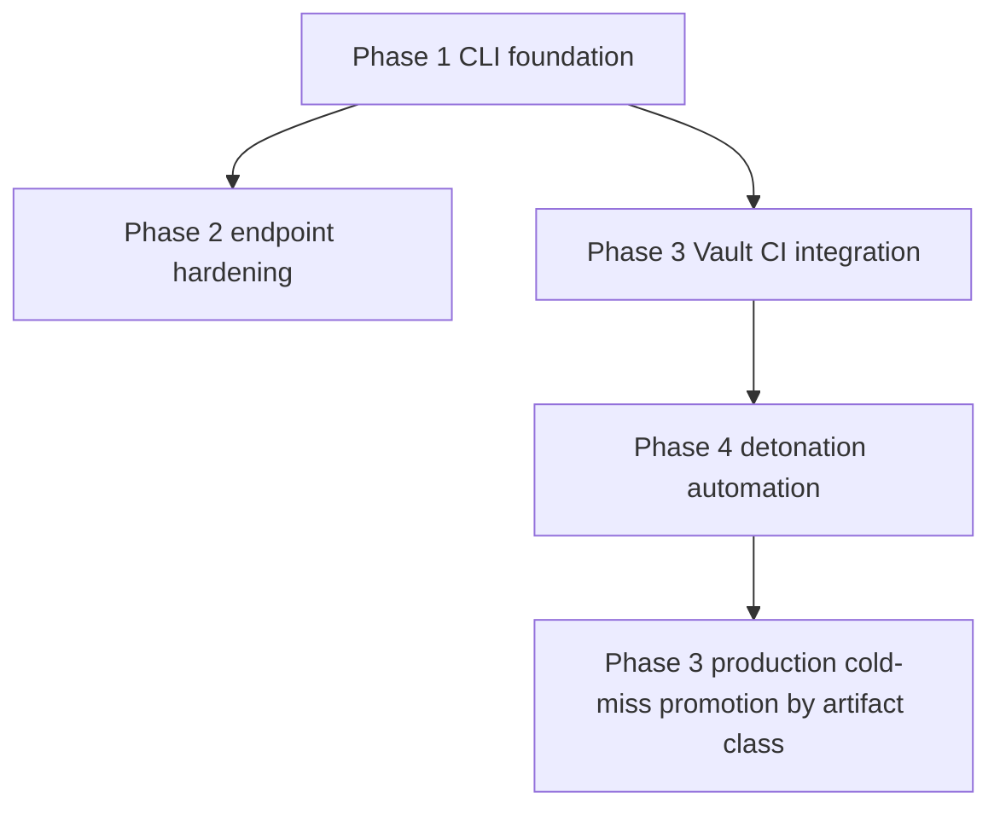

# Cross-Phase Dependency And Gate Map

## Hard Dependencies

## Gate Map

| Gate | Blocks | Source |
| --- | --- | --- |
| No public fallback | any release | GOAL-09 global gate |
| No unapproved artifact serving | any Vault serving path | GOAL-09 global gate |
| No unaudited break-glass | any override/break-glass path | GOAL-09 global gate |
| No routine source/secret/full-payload collection | any telemetry/evidence path | GOAL-09/GOAL-10 privacy gates |
| macOS GA containment validation | GA macOS protection claim | GOAL-09 macOS beta positioning |
| minimum allow-verdict profile | production cold-miss promotion for artifact class | GOAL-09 research contract |
| minimum control-plane API/UX | enterprise Vault launch | GOAL-09 operations addendum |
| Cloudflare signed stale serving proof | hybrid stale edge serving | GOAL-09 Cloudflare policy |
| secure update ADR | external endpoint distribution | GOAL-09 operations addendum |

## Unblocked Overnight Implementation

- Rust workspace foundation.
- Phase 1 CLI skeleton.
- Config, policy, audit, endpoint event data types.
- Shim dry-run scaffolding.
- Sandbox backend interface skeleton.
- Fixture directory scaffolding.

## Blocked Implementation

- Production Vault promotion.
- Cloudflare stale serving.
- Advanced allow automation.
- macOS GA containment claim.
