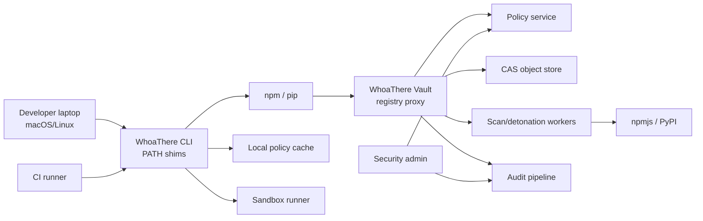
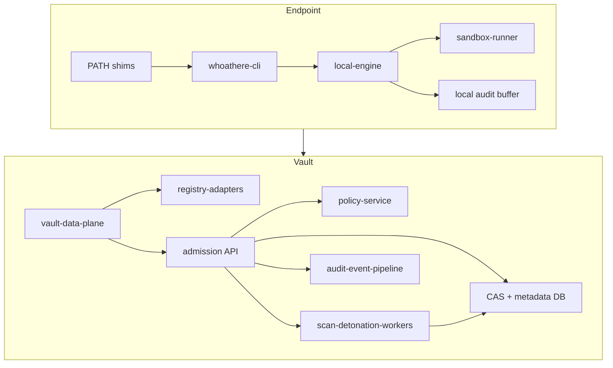

# System Context

## Context Diagram

## Container Diagram

## Trust Boundaries

- Shim to real package manager: command preservation and attribution.
- Local engine to sandbox: untrusted install/build execution boundary.
- Endpoint to Vault: authenticated registry/proxy boundary.
- Quarantine CAS to promoted CAS: scan-before-serve boundary.
- Policy/admin to enforcement: signed policy provenance boundary.

