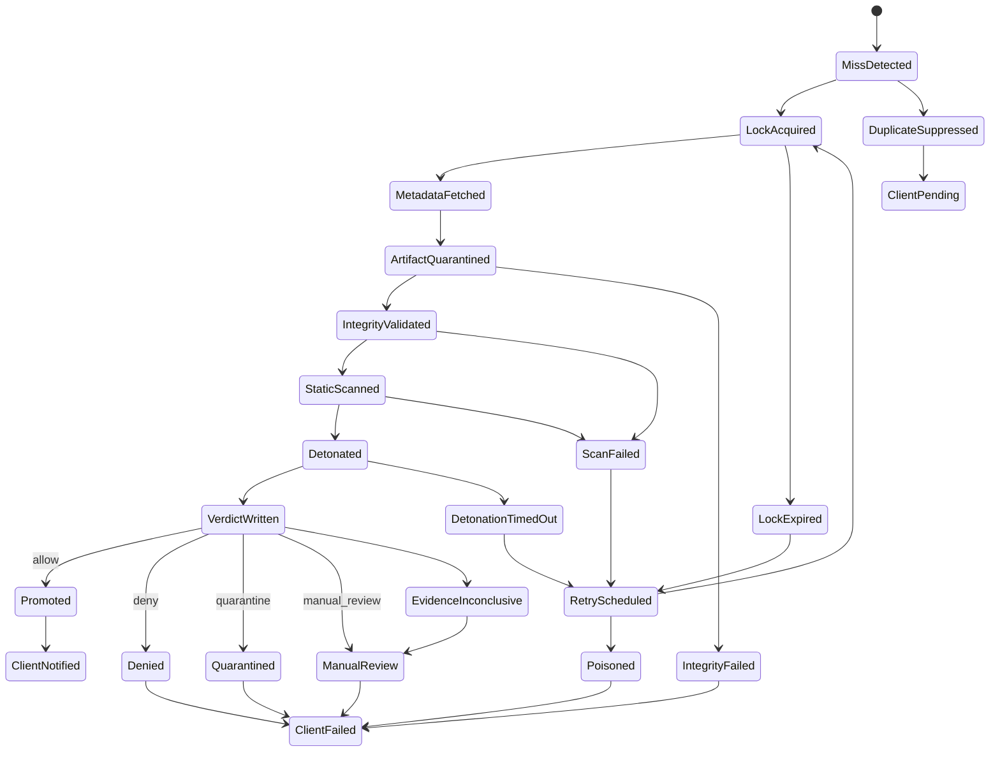

# Cache-Miss State Machine

## Rules

- Admission ID is the idempotency key.
- Duplicate requests wait on or poll the existing admission.
- Poison entries are recorded when fetch, integrity, scan, or detonation repeatedly fails for the same digest.
- Retries use exponential backoff and preserve the same admission ID.
- Circuit breakers stop upstream fetch or detonation when failure rates exceed policy thresholds.
- Every transition emits an audit event.
- Client response is deterministic: approved artifact, pending/manual-review response, deny, or retryable service failure.
- Unknown, scanner-failed, detonator-failed, integrity-failed, or partial-evidence states cannot transition to allow.
- `Promoted` means the servable-generation pointer has committed, not merely that an allow verdict was written.
