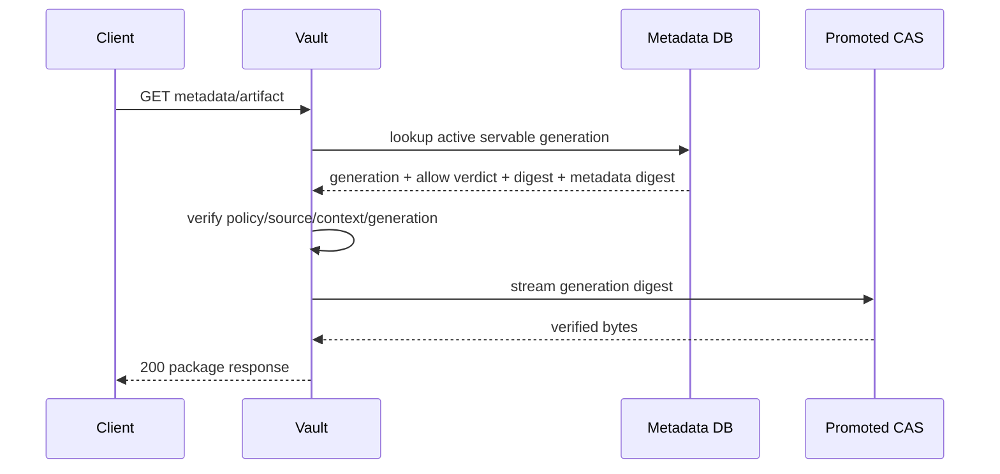
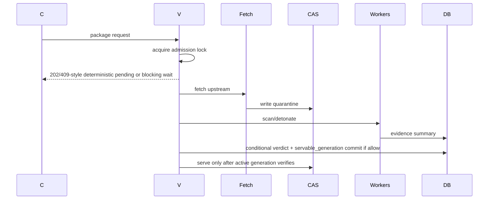

# Request Flow Diagrams

## Warm Cache Hit

## Cache Miss

## Policy Denial

Vault returns `403` with machine-readable reason, policy version, retryability false, and audit ID.

## Upstream Failure

Vault returns `503` retryable if upstream fetch failed before artifact admission; no public fallback is allowed.

## Rollback

Rollback points aliases to a last known approved servable generation only. Pending admissions remain pending or fail deterministic; unapproved upstream content is never exposed.
