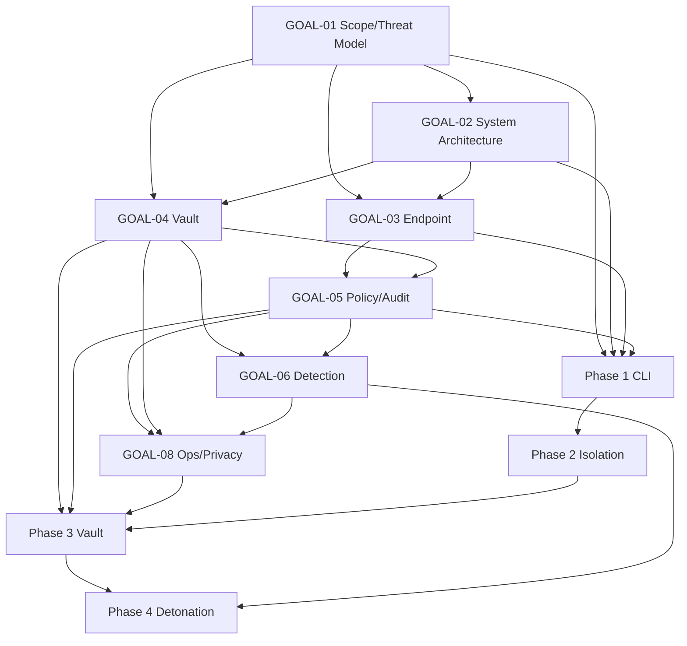

# Roadmap Dependency Graph

## Hard Prerequisites

- Phase 1 requires GOAL-01, GOAL-02, GOAL-03, GOAL-05, and GOAL-08 decisions.
- Phase 2 requires Phase 1 endpoint skeleton and GOAL-03 backend decisions.
- Phase 3 requires GOAL-04, GOAL-05, GOAL-08, and Phase 1 CI integration shape.
- Phase 4 requires GOAL-06 and Phase 3 Vault admission path.

## Soft Prerequisites

- Cloudflare hybrid can wait until after AWS Vault MVP.
- macOS beta containment can harden in Phase 2 while Phase 1 ships explicit beta or telemetry-only semantics.

## Hidden Work Check

No phase depends on an unnamed product-scope decision. Open items are implementation details or explicitly named future goals.
